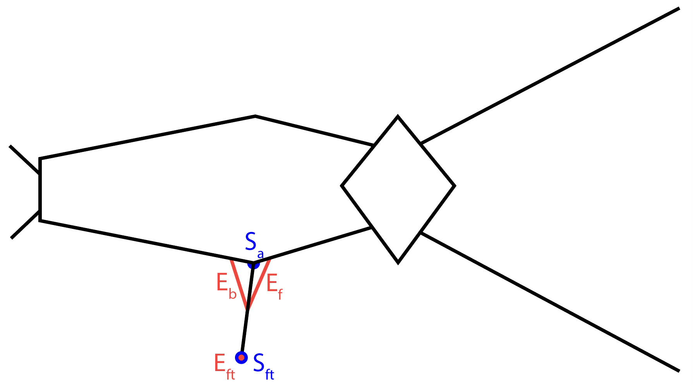
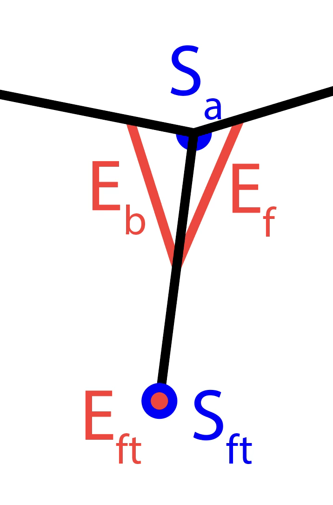
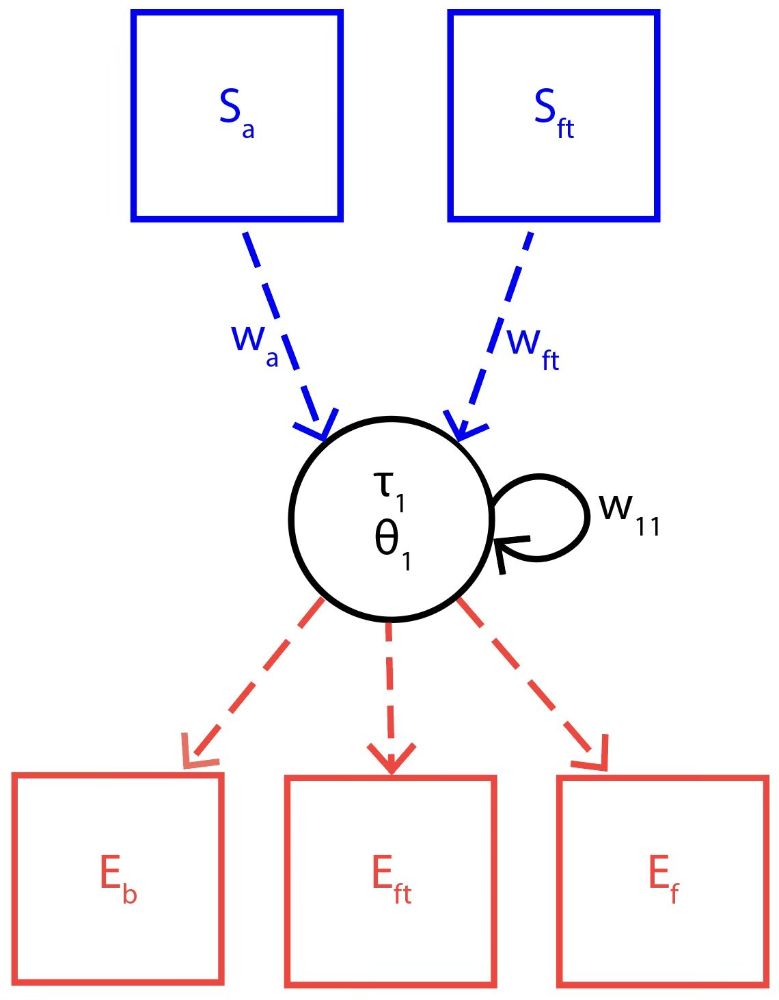
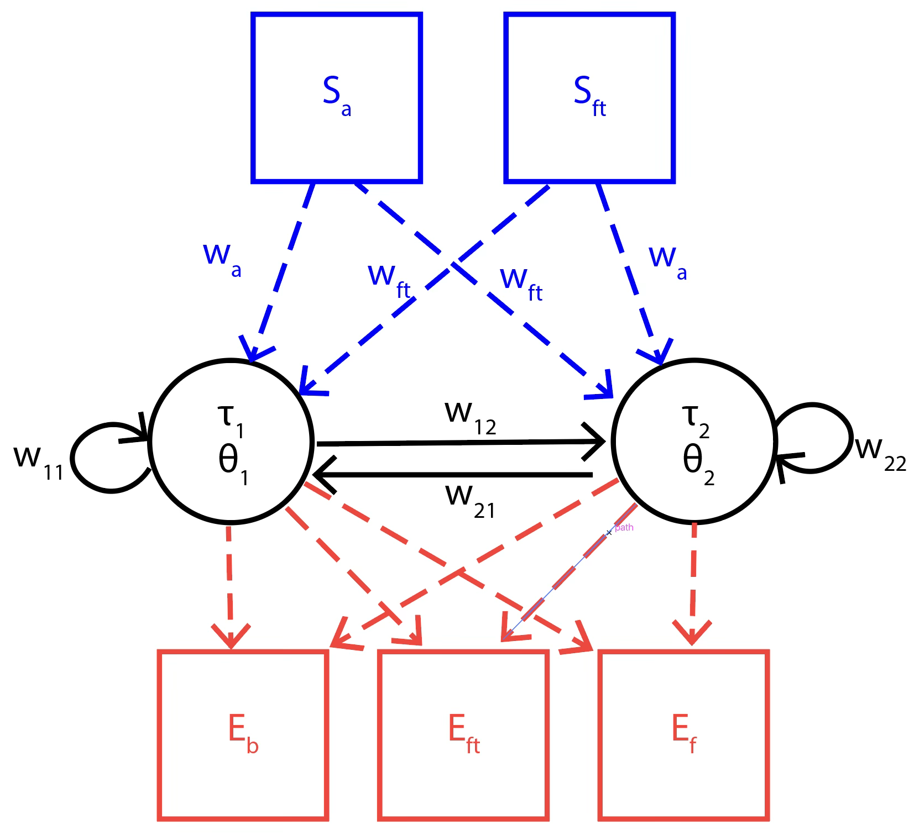
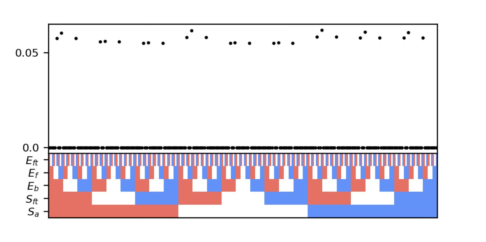
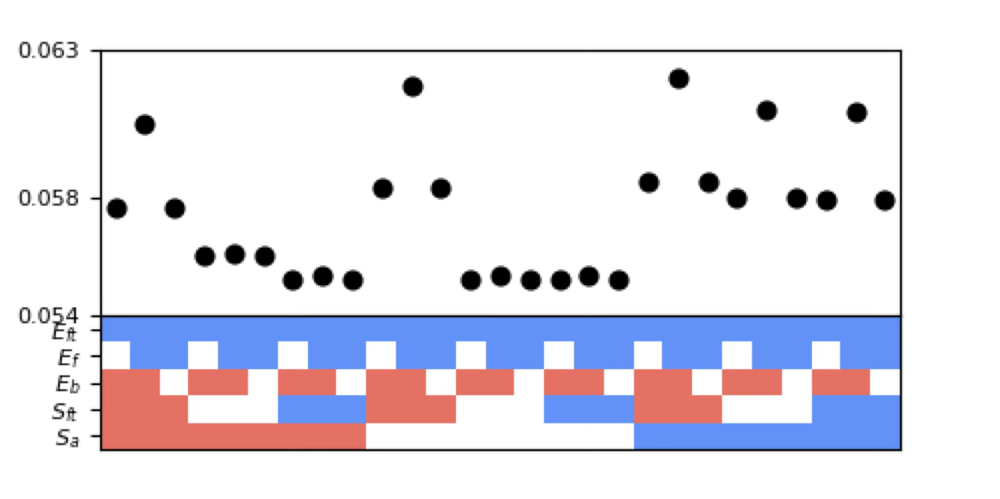
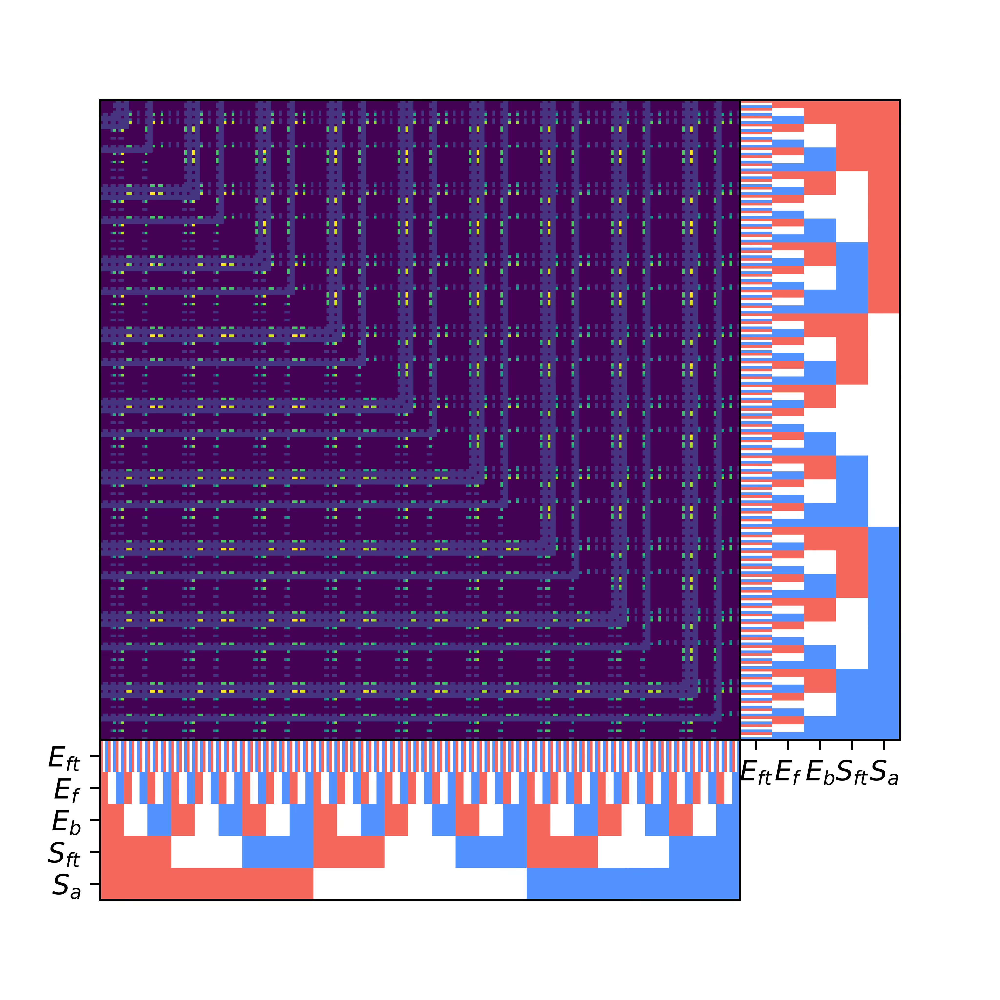
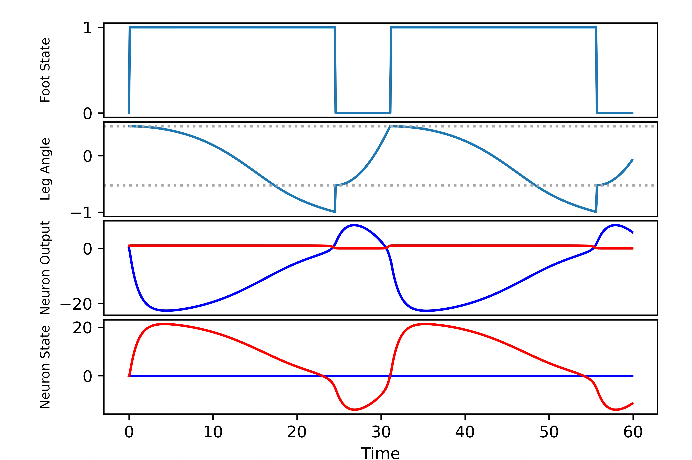

# SingleLeggedWalker

Code for evolving Continuous Time Recurrent Neural Networks (CTRNNs) to perform locomotion using a single-legged walker body — a minimal platform for studying **sensorimotor integration** in embodied cognition.

> The base single-legged walker simulation was developed by Dr. Randall Beer. It has been extended here to support full sensorimotor configurations.

---

## Overview

Sensorimotor integration — the bidirectional coupling between sensation and motor control — plays a central role in embodied cognition. This project investigates how neurons self-organize when sensory and motor connections are not topologically constrained. By exhaustively exploring all possible sensorimotor configurations of a minimal CTRNN-controlled walker, we can ask: *which connections are necessary for locomotion, and which improve it?*

<!--  -->

---

## The Walker Body

The walker has two functional parts — the **leg** and the **foot** — each equipped with both an effector and a sensor:

| Component | Symbol | Role |
|-----------|--------|------|
| Foot effector | `E_ft` | Lifts / plants the foot |
| Forward effector | `E_f` | Swings leg forward |
| Backward effector | `E_b` | Swings leg backward |
| Foot sensor | `S_ft` | Detects whether foot is planted |
| Angle sensor | `S_a` | Reports current leg angle |

<!--  -->

Sensory inputs are defined as:

$$o_{S_a} = w_a \cdot \frac{\phi}{\phi_{\max}}$$

$$o_{S_{ft}} = \begin{cases} 0 & \text{if } o_{E_{ft}} = 0 \\ w_{ft} & \text{if } o_{E_{ft}} = 1 \end{cases}$$

The CTRNN neuron update equation is extended to incorporate sensory feedback:

$$\dot{o}_i = \frac{1}{\tau_i} o_i(1-o_i)\left(\sum_{j=1}^{N} w_{ji}o_j - \sigma^{-1}(o_i) + \theta_i + I_i + w_{ai}o_{S_a} + w_{fti}o_{S_{ft}}\right)$$

where sensory weight signs are constrained: $w_{ai}, w_{fti} \in \{-1, 0, 1\}$.

---

## Network Architectures

Two neural controller architectures are explored:

### 1-Neuron CTRNN

A single recurrently connected neuron drives all three effectors and receives input from both sensors. All 3⁵ = **243 possible sensorimotor configurations** are exhaustively evaluated.

<!--  -->

### 2-Neuron CTRNN

Two mutually connected neurons, each with its own connections to effectors and sensors. The combined effector output is capped to the range `[-1, 1]` to prevent "cheating" via additive output amplification.

<!--  -->

---

## Evolutionary Search

Parameters are optimized using a real-valued evolutionary algorithm (`TSearch`):

| Parameter | 1-Neuron | 2-Neuron |
|-----------|----------|----------|
| Generations | 10,000 | 1,000 |
| Population size | 5,000 | 500 |
| Mutation variance | 0.2 | 0.2 |
| Elitism fraction | 0.05 | 0.05 |
| Time constants τ | [1.0, 10.0] | [1.0, 10.0] |
| Weights *w*, biases θ | [-8.0, 8.0] | [-8.0, 8.0] |
| Sensory weights | [1.0, 8.0] | [1.0, 8.0] |
| Step size | 0.01 | 0.01 |
| Run duration | 220 | 220 |

---

## Results

### 1-Neuron

- Only **27 of 243** configurations achieved forward motion.
- A positive foot effector connection (`+E_ft`) was necessary, along with either a positive forward or negative backward effector connection.
- A **negative foot sensor** and **positive angle sensor** connection produced the greatest fitness gains.
- **Optimal configuration:** `+E_ft, +E_f, -E_b, -S_ft, +S_a`

<!--  -->
<!--  -->

The optimal 1-neuron walker achieves oscillatory locomotion through the mechanical snapback mechanism rather than neural oscillation — demonstrating that body–environment coupling alone can generate rhythmic behavior.

<!--  -->

### 2-Neuron

The best 2-neuron walker used two neurons with complementary connection patterns:

- **Neuron 1:** `+E_ft, +E_f, -E_b, +S_ft, +S_a`
- **Neuron 2:** `+E_ft, -E_f, +E_b, -S_ft, -S_a`

The two neurons appear to act antagonistically, with one neuron driving stance-phase behavior and the other driving swing-phase behavior.

<!--  -->
<!--  -->

### Generalized Observation

For an N-neuron network to produce forward locomotion, the following conditions must hold across neurons:

$$\sum_{i=1}^{N} w_{ift} \geq 0 \quad \wedge \quad \sum_{i=1}^{N} w_{if} > \sum_{i=1}^{N} w_{ib}$$

---

## Project Structure

```
SingleLeggedWalker/
├── main.cpp          # Entry point: sets up and runs evolutionary search
├── LeggedAgent.cpp   # Walker body simulation (physics + sensors/effectors)
├── LeggedAgent.h
├── CTRNN.cpp         # Continuous Time Recurrent Neural Network
├── CTRNN.h
├── TSearch.cpp       # Evolutionary search algorithm
├── TSearch.h
├── VectorMatrix.h    # Vector/matrix utilities
├── random.cpp        # Random number generation
├── random.h
└── Makefile
```

---

## Building & Running

```bash
make
./main
```

Output is written to standard out. Redirect to a file as needed:

```bash
./main > results.dat
```

---

## Background & References

This work builds on a lineage of minimally cognitive walker experiments using CTRNNs:

- Beer, R. D. (2010). *Fitness space structure of a neuromechanical system.*
- Poulet, J. F., & Hedwig, B. (2003). *A corollary discharge mechanism modulates central auditory processing in singing crickets.*

Previous models studied motor integration with limited or no sensory feedback, and when sensors were included, they were restricted to angle input with hand-coded phase-switching logic. This project is the first to exhaustively evaluate the **full space of sensorimotor configurations** for this walker body.

---

## License

MIT — see [LICENSE](LICENSE) for details.
